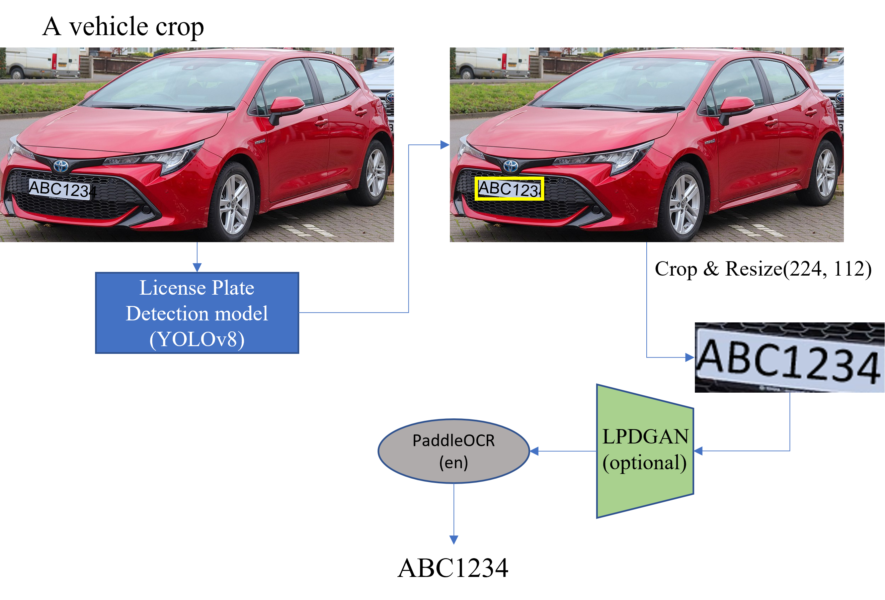

# ANPR for TW license plate 

[English](../readme.md)

## pipeline:


## 環境
Python >= 3.10
- 第三方套件
    - numpy
    - opencv 
    - torch
    - ultralytics
    - EasyOCR
    - Levenshtein
    - paddle 
        - cpu version : ```pip install paddlepaddle``` 
            - 這是我這邊使用的版本
        - gpu version : ```pip install paddlepaddle-gpu```
            - 如果使用 GPU 版本，請在執行前先確認  cuDNN libraries 路徑是否有在預設路徑裡面
            - 如果 cuDNN libraries 是沒有裝在 default 環境的話，請在執行 python 指令前，先將 cuDNN libraries 安裝的路徑添加到該 session 的 ```$LD_LIBRARY_PATH``` :
                - ```export LD_LIBRARY_PATH=/path/to/your/libraries:$LD_LIBRARY_PATH```
                - e.g.: 我將 cuDNN 額外用 conda 安裝在自己的環境，那執行前要先下: ```export LD_LIBRARY_PATH={$HOME}/.conda/envs/tenv/lib:$LD_LIBRARY_PATH``` ，然後再下 python ....
    - paddleocr:
        - ```pip install paddleocr```

    ** 第一次 inital paddleOCR 後，OCR 模型會被保存在:     
    - ```~/.paddleocr/whl/det/en/en_PP-OCRv3_det_infer/en_PP-OCRv3_det_infer.tar```
    - ```~/.paddleocr/whl/rec/en/en_PP-OCRv4_rec_infer/en_PP-OCRv4_rec_infer.tar```


## Deblur
- 採用 LPDGAN (論文 : [A Dataset and Model for Realistic License Plate Deblurring](https://www.ijcai.org/proceedings/2024/0086.pdf)) 來對車牌進行去模糊的處理，目的為加強OCR 對車牌辨識的準確性
### Train:
### Evaluation: Using OCR performance:
  - 由於這項任務的下游是使用 OCR 進行車牌辨識，所以這邊的 metrics 直接使用 ocr 對去模糊化後的車牌影像進行辨識，使用 OCR Accuracy (1 - CER) 來當作評估指標，就沒有用 SSIM,PSNR,Perceptual Loss 等影像修復的 metrics 來去看
    - ```python ocr_eval.py --label {the label file} --data_root {the root of test imgs} --deblur {the weighted of trained SwinTrans_G} --deblur_ckpt_dir {the directory that the pretrained SwinTrans_G at, has a default value}```
    
    -  e.g. ```python ocr_eval.py --data_root ./dataset/third_party/blur/ --label_file ./dataset/third_party/label.json --deblur net_G.pt```

    - label_file:
      - 一個 json Object 格式的檔案，每個 key-value 分別為 : ```檔名:車牌```
        - e.g.: 
            ```
            {"1.jpg":"AAA0000", "2.jpg":"BB111", ... }
            ```
    - data_root: testing 圖片保存的根目錄，在程式執行的時候，會將 ```label_file``` 裡面的每個圖片檔名與 ```data_root``` 連接來當作每張 test image 的路徑。 
        - e.g. ```--data_root ./dataset/third_party/blur/ ```，加上上面舉例的 label_file ，則圖片完整路徑在 ```ocr_eval.py``` 會是 ```["./dataset/third_party/blur/1.jpg", "./dataset/third_party/blur/2.jpg", ...]``` 而 label 就是會是按照 label_file 對應的順序產生 : ```["AAA0000", "BB111", ...]```

## 車牌辨識完整的執行方法:

1. 下載車牌偵測模型的權重: 請到[Automatic-Number-Plate-Recognition-Using-YOLOv8-EasyOCR/models](https://github.com/ANPR-ORG/Automatic-Number-Plate-Recognition-Using-YOLOv8-EasyOCR/tree/main/models) 下載 ```anpr_v8.pt```，儲存到 [```anpr/anpr_v8.pt```](```./anpr```)

2. (Optional) 下載 Pretrained Generator of LPDGAN 權重:
預訓練 lpdgan swintransformer 請到 https://drive.google.com/file/d/1sQD1uKOBpPCYGC8WGhoil47dOC2RjVQx/view?usp=sharing (```net_G.pt```)下載，並儲存到 [```./LPDGAN/checkpoints/net_G.pt```](./LPDGAN/checkpoints)

### 使用範例
請看參考 [```unit_inference.py```](./unit_inference.py)。

- 其中的 [```recognition_a_car()```](./unit_inference.py#L14) 有展示如何對一台車子的 crop 進行車牌辨識

[```unit_inference.py```](./unit_inference.py) 參數:
- ```--img``` : 要做車牌辨識的 crop 的路徑
- ```--lp_yolo``` : 車牌偵測的 yolov8 模型權重路徑。 
    - default 已經把路徑設置好了，如果要換其他權重再改
- ```--deblur``` : 如果要使用 LPGAN 去模糊，請下這個參數 (flag : store_true)
- ```lpdgan``` : 預訓練的 LPDGAN Generator的權重路徑。
    - **如果參數有下 --deblur，這個才會有用。**
    - default 已經把路徑設置好了，如果要換其他權重再改

針對該 crop，最終的車牌辨識結果是 [```recognition_a_car() 這個函數中的 txt 這個 str```](./unit_inference.py#L45) 這個變數

e.g.:
``` python unit_inference.py --img ./dataset/cars/0.png --deblur```

**以上指令 demo 用的圖片由於是隱私的資料及，如果真的想執行，請到 https://drive.google.com/file/d/1W7kjO5eJXpqG11BtDkuL0MsdQdxB7SL2/view?usp=sharing 要求權限。
- 請說明身分

## TODO
[TODO](./TODO.md)

## Acknowledgments

This project utilizes code and resources from the following repositories:

- [LPDGAN](https://github.com/haoyGONG/LPDGAN.git)
    - origin paper: https://www.ijcai.org/proceedings/2024/0086.pdf
- [Automatic-Number-Plate-Recognition-Using-YOLOv8-EasyOCR](https://github.com/ANPR-ORG/Automatic-Number-Plate-Recognition-Using-YOLOv8-EasyOCR.git)

We deeply appreciate the work of these developers and their contributions to the open-source community.